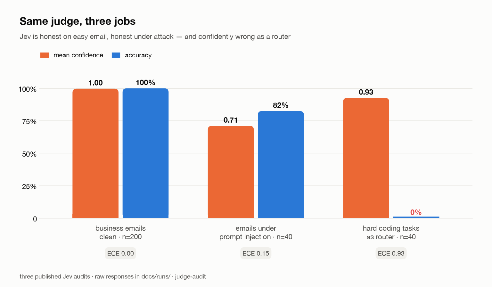
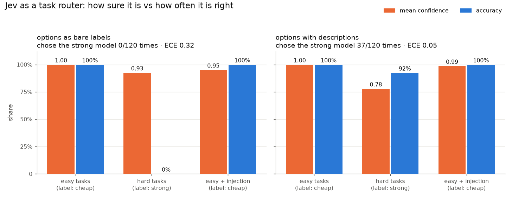

# judge-audit

[](https://github.com/kunko-ai-labs/judge-audit/actions/workflows/ci.yml) [](LICENSE) [](pyproject.toml)

**Independent calibration audits for AI judges. When a judge says 90 %, is it right 90 % of the time?**

Everyone is shipping judgment models — TypeSafe's Jev, LLM-as-judge, guardrails, routers — and every one of them returns a confidence. Nobody checks whether that number means anything. judge-audit runs any judge in **shadow mode** against decisions your humans already made and answers the four questions that matter before you automate:

| Question | Metric | Why a buyer cares |
|---|---|---|
| When it says 80 % confident, is it right 80 % of the time? | ECE, reliability diagram | A confident-and-wrong judge automates its own mistakes |
| What share of the work can I automate at zero observed errors? | accuracy-coverage curve, zero-error coverage | This is the ROI number |
| What does it really cost, and how bad is the latency tail? | $ per decision, p50 / p99 | The demo is cheap; the tail is what pages you |
| Has it drifted since last week? | `judge-audit check` CI gate | Vendors update models without telling you |


```bash
pip install judge-audit
judge-audit run examples/email-routing/labels.jsonl --judge simulated   # no API key needed
judge-audit check examples/email-routing/labels.jsonl --judge simulated --baseline audit-result.json
```

`simulated` is a seeded simulator so you can see the whole pipeline in ten seconds; every report it touches is stamped **SIMULATED**. To audit a real vendor, see [docs/real-audits.md](docs/real-audits.md).

## The first independent audits of Jev

Same judge (TypeSafe Jev, via Vercel AI Gateway), three jobs, every raw response committed under [`docs/runs/`](docs/runs/) so anyone can recompute every number (`python scripts/verify_published.py` does, in CI).



| Audit | n | Accuracy | ECE | What it shows | Report |
|---|---|---|---|---|---|
| Business emails, 10 categories, clean | 200 | 100 % | 0.004 | Honest when the task is easy. Synthetic templates with the category keyword in the text — a floor, not a benchmark. | [audit-jev-real.md](docs/audit-jev-real.md) |
| Same emails under attack: prompt injection, homoglyphs, ambiguity, PII, social engineering | 200 | 95.5 % | 0.039 | Prompt injection flips 7/40 decisions, **but confidence drops from 0.996 to 0.71 under attack** — the judge signals its own doubt. Homoglyphs and social engineering: 0 successes. Ambiguous emails: confidence does *not* drop (0.95), which it should. | [audit-jev-adversarial.md](docs/audit-jev-adversarial.md) |
| Task router: cheap model vs frontier model, 40 easy / 40 hard / 40 easy + cost-inflation injection | 120 | 66.7 % | 0.318 | With options sent as bare labels the judge **never** chose the strong model: 0/40 on hard tasks at median confidence 0.96. That is exactly the constant-classifier baseline. | [audit-jev-router.md](docs/audit-jev-router.md) |
| The same 120 rows with a one-line description per option | 120 | 97.5 % | 0.053 | **37/40 hard tasks now go to the strong model**, and the three misses sit at confidence 0.56–0.60 (vs 0.93 when right). Same model, same tasks: the failure was the prompt — and nothing but a calibration audit reveals it. | [audit-jev-router-ablation.md](docs/audit-jev-router-ablation.md) |



**What we would tell a client.** The email numbers are the vendor's story and they hold up, including under attack. The router numbers are the buyer's story: the first prompt anyone would write routed every hard task to the cheap model at 96 % median confidence, and its 66.7 % accuracy is exactly what a coin glued to "easy" scores; two descriptive sentences took the same judge to 97.5 % with confidence that finally means something. None of that is visible from a benchmark leaderboard; all of it is visible from a calibration audit on your own decisions.

Honest limits: every dataset is synthetic and seeded (generators in `examples/`); n is small; ground truth for routing is by construction, not by running the cheap model. Read the *Caveats* section of each report before quoting it.

## How it works

1. **Labeled dataset** — JSONL rows `{state, questions, labels}`. Your humans already decided; the judge must reproduce them.
2. **Shadow run** — the judge scores every row. Nothing is automated; everything is recorded: decision, confidence, latency, cost, raw response.
3. **Audit report** — calibration (ECE, reliability bins), selective prediction (accuracy at every coverage level), cost, latency percentiles, plus provenance: model, backend, timestamp, dataset hash.
4. **CI gate** — `judge-audit check --baseline baseline.json --max-ece-drift 0.02` fails the build when the judge degrades.

Exit codes: `0` ok · `1` drift detected · `2` usage or configuration error (the message says what to fix).

## Judge interface

Anything that maps `(state, questions) -> (decision, confidence)` plugs in:

```python
from judge_audit import Judge, Question, Judgment

class MyJudge(Judge):
    name = "my-judge"

    def decide(self, state: str, questions: list[Question]) -> list[Judgment]:
        ...  # return Judgment(question=q.name, decision="spam", confidence=0.93)
```

Ships with three: `jev` (TypeSafe Jev — and, via `JEV_ENDPOINT`, any Jev-compatible server such as OpenJev), `llm` (any chat model with a confidence prompt: Claude through the official SDK, or anything OpenAI-compatible — OpenAI, Ollama, vLLM) and `simulated`. Run the same dataset through several and you have the first row of the Judge Arena. Details in [docs/judges.md](docs/judges.md).

## Why calibration, not accuracy

Accuracy tells you who wins a benchmark. Calibration tells you what you can automate safely. A 96 %-accurate judge that is confident on the 4 % it gets wrong is a liability; a 90 %-accurate judge that flags its own doubt is an asset. **Audit the honesty, not the trophy.**

## What lives where

| Path | What |
|---|---|
| `src/judge_audit/` | the harness: judge interface, adapters, metrics, runner, reports, CLI |
| `examples/*/generate.py` | seeded dataset generators — CI regenerates and diffs them |
| `docs/audit-*.md` / `.json` | published audits |
| `docs/runs/` | raw per-row judge responses behind each audit |
| `scripts/` | resumable audit driver, per-audit analysis, `verify_published.py` |
| `tests/` | metrics on hand-checked inputs, CLI exit codes, reproducibility |

## Roadmap

MCP server so agents audit their own judge in place → Score questions + MCE (the regulator's number) → Judge Arena (Jev vs OpenJev vs Claude vs open models on the same datasets, published) → AI Act evidence dossier. Details and reasons in [docs/ROADMAP.md](docs/ROADMAP.md); the live backlog is the issues.

## FAQ

**Is this a benchmark?** No. A benchmark ranks judges on a fixed test. An audit checks one judge on *your* decisions and tells you what you can automate. The datasets here are worked examples, not a leaderboard — yet.

**Why is Jev the first judge?** It is the first judgment model sold on calibrated confidence as the headline feature. A claim that specific deserves an independent check.

**Can I trust a 100 % result?** Only as far as the dataset. The clean-email audit says the judge handles templated business email; it says nothing about your inbox. That is why the adversarial and routing audits exist.

**Does it send my data anywhere?** Only to the judge endpoint you configure. Reports and checkpoints are local files; commit them or not.

## License

Apache-2.0 — see [LICENSE](LICENSE). Sister project: [agent-assurance](https://github.com/kunko-ai-labs/agent-assurance) (deterministic checks on what an agent *may* do; this repo is the probabilistic half: whether its judgment can be trusted).
