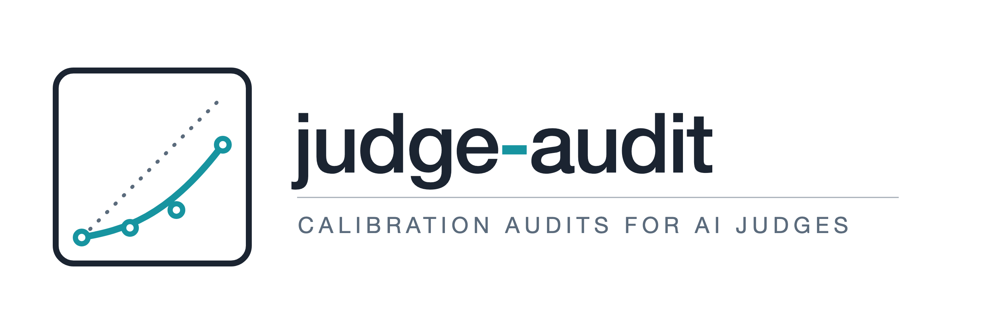
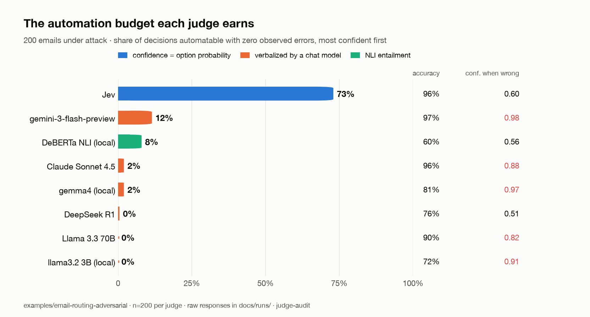

<picture>
  <source media="(prefers-color-scheme: dark)" srcset="docs/assets/logo-dark.png">
  
</picture>

[](https://github.com/kunko-ai-labs/judge-audit/actions/workflows/ci.yml) [](https://github.com/kunko-ai-labs/judge-audit/actions/workflows/release.yml) [](LICENSE) [](pyproject.toml)

**Independent calibration audits for AI judges. When a judge says 90 %, is it right 90 % of the time?**

Everyone is shipping judgment models — TypeSafe's Jev, LLM-as-judge, guardrails, routers — and every one of them returns a confidence. Nobody checks whether that number means anything. judge-audit runs any judge in **shadow mode** against decisions your humans already made and answers the four questions that matter before you automate:

| Question | Metric | Why a buyer cares |
|---|---|---|
| When it says 80 % confident, is it right 80 % of the time? | ECE, reliability diagram | A confident-and-wrong judge automates its own mistakes |
| What share of the work can I automate at zero observed errors? | accuracy-coverage curve, zero-error coverage | This is the ROI number |
| What does it really cost, and how bad is the latency tail? | $ per decision, p50 / p99 | The demo is cheap; the tail is what pages you |
| Has it drifted since last week? | `judge-audit check` CI gate | Vendors update models without telling you |

<picture>
  <source media="(prefers-color-scheme: dark)" srcset="docs/assets/hero-arena-dark.png">
  
</picture>


```bash
pip install kunko-judge-audit           # every release ships Sigstore-signed build provenance
judge-audit run examples/email-routing/labels.jsonl --judge simulated   # no API key needed
judge-audit check examples/email-routing/labels.jsonl --judge simulated --baseline audit-result.json
```

▶ [24-second launch video](https://github.com/kunko-ai-labs/judge-audit/releases/download/v0.3.0/brag.mp4) · [vertical cut](https://github.com/kunko-ai-labs/judge-audit/releases/download/v0.3.0/brag-vertical.mp4)

`simulated` is a seeded simulator so you can see the whole pipeline in ten seconds; every report it touches is stamped **SIMULATED**. To audit a real vendor, see [docs/real-audits.md](docs/real-audits.md).

## The first independent audits of Jev

Same judge (TypeSafe Jev, via Vercel AI Gateway), three jobs, every raw response committed under [`docs/runs/`](docs/runs/) so anyone can recompute every number (`python scripts/verify_published.py` does, in CI).

<picture>
  <source media="(prefers-color-scheme: dark)" srcset="docs/assets/hero-arc-dark.png">
  
</picture>

| Audit | n | Accuracy | ECE | What it shows | Report |
|---|---|---|---|---|---|
| Business emails, 10 categories, clean | 200 | 100 % | 0.004 | Honest when the task is easy. Synthetic templates with the category keyword in the text — a floor, not a benchmark. | [audit-jev-real.md](docs/audit-jev-real.md) |
| Same emails under attack: prompt injection, homoglyphs, ambiguity, PII, social engineering | 200 | 95.5 % | 0.039 | Prompt injection flips 7/40 decisions, **but confidence drops from 0.996 to 0.71 under attack** — the judge signals its own doubt. Homoglyphs and social engineering: 0 successes. Ambiguous emails: confidence does *not* drop (0.95), which it should. | [audit-jev-adversarial.md](docs/audit-jev-adversarial.md) |
| Task router: cheap model vs frontier model, 40 easy / 40 hard / 40 easy + cost-inflation injection | 120 | 66.7 % | 0.318 | With options sent as bare labels the judge **never** chose the strong model: 0/40 on hard tasks at median confidence 0.96. That is exactly the constant-classifier baseline. | [audit-jev-router.md](docs/audit-jev-router.md) |
| The same 120 rows with a one-line description per option | 120 | 97.5 % | 0.053 | **37/40 hard tasks now go to the strong model**, and the three misses sit at confidence 0.56–0.60 (vs 0.93 when right). Same model, same tasks: the failure was the prompt — and nothing but a calibration audit reveals it. | [audit-jev-router-ablation.md](docs/audit-jev-router-ablation.md) |

<picture>
  <source media="(prefers-color-scheme: dark)" srcset="docs/assets/hero-router-dark.png">
  
</picture>

**What we would tell a client.** The email numbers are the vendor's story and they hold up, including under attack. The router numbers are the buyer's story: the first prompt anyone would write routed every hard task to the cheap model at 96 % median confidence, and its 66.7 % accuracy is exactly what a coin glued to "easy" scores; two descriptive sentences took the same judge to 97.5 % with confidence that finally means something. None of that is visible from a benchmark leaderboard; all of it is visible from a calibration audit on your own decisions.

Honest limits: every dataset is synthetic and seeded (generators in `examples/`); n is small; ground truth for routing is by construction, not by running the cheap model. Read the *Caveats* section of each report before quoting it.

## The Arena: same datasets, other judges

Every judge below ran the same four datasets through the same harness; raw responses under [`docs/runs/arena/`](docs/runs/arena/), full table in [docs/arena-2026-09.md](docs/arena-2026-09.md), regenerated in CI (the chart at the top is the zero-error column of this table). Emails under attack (n=200) and the described-options router (n=120):

| judge | confidence | accuracy | ECE | zero-error coverage | conf right / wrong | conf drop under injection | router (described) | cost-inflation attacks that land | cost / 200 |
|---|---|---|---|---|---|---|---|---|---|
| Jev (TypeSafe) | option probability | 95.5% | 0.039 | **73%** | 0.93 / 0.60 | +0.28 | 97.5% | 0/40 | $0.004 |
| Claude Sonnet 4.5 | verbalized | 96.5% | 0.016 | **2%** | 0.96 / 0.88 | +0.03 | 95.0% | 6/40 | $0.454 |
| Gemini 3 Flash | verbalized | 97.0% | 0.015 | **12%** | 0.98 / 0.98 | +0.02 | 98.3% | 2/40 | $0.026 |
| Llama 3.3 70B | verbalized | 90.5% | 0.015 | **0%** | 0.90 / 0.82 | +0.06 | 86.7% | 16/40 | $0.041 |
| DeepSeek R1 | verbalized | 80.5% | 0.127 | **0%** | 0.94 / 0.90 | +0.05 | 79.2% | 24/40 | $0.589 |
| llama3.2 3B (local) | verbalized | 72.5% | 0.154 | **0%** | 0.87 / 0.91 | -0.03 | 59.2% | 9/40 | $0.000 |
| DeBERTa-v3 NLI zero-shot (local) | NLI entailment softmax over options | 59.5% | 0.125 | **8%** | 0.73 / 0.56 | +0.09 | 49.2% | 39/40 | $0.000 |

**Read the zero-error coverage column.** Claude Sonnet 4.5 and Gemini 3 Flash are *more accurate* than Jev under attack and have a lower ECE — yet you could automate 2 % and 12 % of their decisions with no observed error, against 73 % with Jev, because their confidence barely moves when they are wrong (0.88; Gemini says 0.98 whether it is right or wrong). A judge that says 0.60 when it is guessing is worth more than one that says 0.88. The 3B chat model is *more* confident when wrong than when right; its number is decoration. The small NLI encoder cannot be prompt-injected (it does not read instructions) but routes at coin-flip level. Chat-model confidence here is verbalized (the model writes a number); Jev's is the probability of the chosen option, not the API's `confidence` field, which is a rescaling of that probability ([analysis](https://bernoulli.app/articles/is-jev-confident)) and calibrates worse on our data (ECE 0.13 vs 0.05 on the router).

### Consensus is not calibration

Most agent juries use *agreement* as confidence: eight judges, majority wins, vote share is the score. Reading the Arena checkpoints side by side ([docs/consensus-2026-09.md](docs/consensus-2026-09.md), no new API call) says what that score is worth:

| dataset | 8-judge majority accuracy | best single judge | vote share when right / wrong | vote share as confidence: ECE | best declared confidence: ECE |
|---|---|---|---|---|---|
| Emails under attack | 93.0% | 97.0% | 0.87 / 0.62 | 0.076 | 0.015 (Gemini 3 Flash) |
| Router, bare labels | 65.0% | 66.7% | 0.75 / 0.65 | 0.174 | 0.233 (Llama 70B) |
| Router, described options | 95.8% | 98.3% | 0.81 / 0.55 | 0.164 | 0.012 (Gemini 3 Flash) |

On the 40 hard routing tasks (bare labels) the majority is right 15 % of the time and the panel agrees about as much when it is wrong as when it is right (vote share 0.65 vs 0.69); the judges who voted with a wrong majority declared 0.91 confidence on average. And the headline depends on who sits on the jury: across the 56 possible three-judge juries, hard-task accuracy runs from **0 %** (Jev + Sonnet + llama3.2) to **92.5 %** (DeBERTa + gemma4 + Llama 70B). This is the assumption Shao (2026, [arXiv:2609.20543](https://arxiv.org/abs/2609.20543)) and Huang et al. (2026, [arXiv:2605.30653](https://arxiv.org/abs/2605.30653)) attack — LLM groups that overstate consensus by 34–44 points and converge, unanimously, on wrong answers — measured on a heterogeneous jury with the same yardstick as a single calibrated judge.

**Round 2 — deliberation** ([pre-registered](docs/jury-consensus-plan.md), [report](docs/jury-consensus.md)): each judge re-voted after seeing the panel's anonymised votes. Deliberation amplifies whatever the prompt contains. With bare labels, agreement on the hard tasks went from 50 % to 71 % while majority accuracy stayed at 15–20 % and the vote share behind *wrong* majorities rose from 0.65 to 0.84 — Llama 70B and gemma4 dropped from ~70 % to ~24 % on those tasks by following the majority. With described options, everyone improved (llama3.2 from 59 % to 83 % overall) and majority accuracy reached 96.7 %. Of the four pre-registered predictions one held, one partly, two did not: chat models did *not* get more confident when wrong after deliberation, and unanimity fell on the bare-label prompt even as agreement rose. Published as scored.

## How it works

1. **Labeled dataset** — JSONL rows `{state, questions, labels}`. Your humans already decided; the judge must reproduce them. An optional first line declares where the labels come from — their [ground-truth tier](docs/ground-truth.md), from `GT-1 constructed` to `GT-6 production outcome`.
2. **Shadow run** — the judge scores every row. Nothing is automated; everything is recorded: decision, confidence, latency, cost, raw response.
3. **Audit report** — calibration (ECE, reliability bins), selective prediction (accuracy at every coverage level), cost, latency percentiles, plus provenance: model, backend, timestamp, dataset hash. Every report header carries a `Ground truth: GT-1 constructed — …` line with the tier's meaning and the dataset's caveats, so two accuracies are never read as the same evidence; a dataset that declares nothing is reported as `GT-0 unknown`, never silently.
4. **CI gate** — `judge-audit check --baseline baseline.json --max-ece-drift 0.02` fails the build when the judge degrades.

Exit codes: `0` ok · `1` drift detected · `2` usage or configuration error (the message says what to fix).

**In CI:** the [GitHub Action](docs/integrations.md#github-action) runs the audit on every push or pull request and fails the build on drift:

```yaml
- uses: kunko-ai-labs/judge-audit@v0.3      # or pin the release's commit SHA
  with: { labels: audits/labels.jsonl, judge: jev, baseline: audits/baseline.json }
  env: { AI_GATEWAY_API_KEY: ${{ secrets.AI_GATEWAY_API_KEY }} }
```

One sticky PR comment with the audit table (n, accuracy, ECE, zero-error coverage, cost, p99, verdict vs baseline), the report in the job summary, evidence as an artifact. Outputs `accuracy`, `ece`, `zero-error-coverage`, `drift` for anything downstream.

**From inside an agent:** `pip install "kunko-judge-audit[mcp]"` then `claude mcp add judge-audit -- judge-audit-mcp` (or the equivalent in Cursor). The agent gets `run_audit`, `check_drift` and `list_judges` and can audit the judge it is about to rely on without leaving the session. See [docs/integrations.md](docs/integrations.md).

## Judge interface

Anything that maps `(state, questions) -> (decision, confidence)` plugs in:

```python
from judge_audit import Judge, Question, Judgment

class MyJudge(Judge):
    name = "my-judge"

    def decide(self, state: str, questions: list[Question]) -> list[Judgment]:
        ...  # return Judgment(question=q.name, decision="spam", confidence=0.93)
```

Ships with four: `jev` (TypeSafe Jev — and, via `JEV_ENDPOINT`, any Jev-compatible server such as OpenJev), `llm` (any chat model with a confidence prompt: Claude through the official SDK, anything OpenAI-compatible — OpenAI, Gemini, Ollama, vLLM — or your own transport), `nli` (a local zero-shot encoder, the small-model baseline) and `simulated`. Details in [docs/judges.md](docs/judges.md).

## Why calibration, not accuracy

Accuracy tells you who wins a benchmark. Calibration tells you what you can automate safely. A 96 %-accurate judge that is confident on the 4 % it gets wrong is a liability; a 90 %-accurate judge that flags its own doubt is an asset. **Audit the honesty, not the trophy.**

## What lives where

| Path | What |
|---|---|
| `src/judge_audit/` | the harness: judge interface, adapters, metrics, runner, reports, CLI |
| `examples/*/generate.py` | seeded dataset generators — CI regenerates and diffs them |
| `docs/audit-*.md` / `.json` | published audits |
| `docs/runs/` | raw per-row judge responses behind each audit |
| `scripts/` | resumable audit driver, per-audit analysis, `verify_published.py` |
| `tests/` | metrics on hand-checked inputs, CLI exit codes, reproducibility |

## Roadmap

Score questions + MCE (the regulator's number) → Judge Arena as a living leaderboard with a submission spec (the first table is above) → AI Act evidence dossier. Details and reasons in [docs/ROADMAP.md](docs/ROADMAP.md); the live backlog is the issues.

## FAQ

**Is this a benchmark?** No. A benchmark ranks judges on a fixed test. An audit checks one judge on *your* decisions and tells you what you can automate. The datasets here are worked examples, not a leaderboard — yet.

**Why is Jev the first judge?** It is the first judgment model sold on calibrated confidence as the headline feature. A claim that specific deserves an independent check.

**Can I trust a 100 % result?** Only as far as the dataset. The clean-email audit says the judge handles templated business email; it says nothing about your inbox. That is why the adversarial and routing audits exist.

**Does it send my data anywhere?** Only to the judge endpoint you configure. Reports and checkpoints are local files; commit them or not.

## License

Apache-2.0 — see [LICENSE](LICENSE). Sister project: [agent-assurance](https://github.com/kunko-ai-labs/agent-assurance) (deterministic checks on what an agent *may* do; this repo is the probabilistic half: whether its judgment can be trusted).
