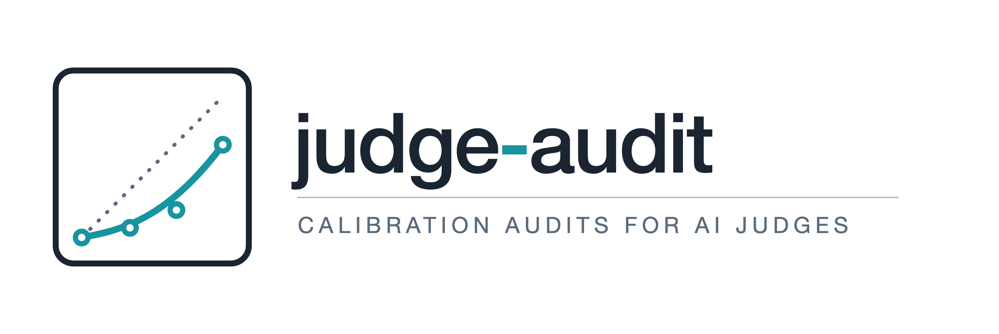
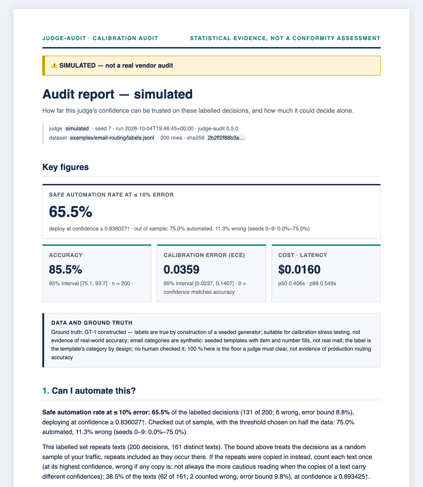

<picture>
  <source media="(prefers-color-scheme: dark)" srcset="docs/assets/logo-dark.png">
  
</picture>

[](https://github.com/kunko-ai-labs/judge-audit/actions/workflows/ci.yml) [](https://github.com/kunko-ai-labs/judge-audit/actions/workflows/release.yml) [](LICENSE) [](pyproject.toml)

## Can your AI judge decide alone?

**judge-audit replays decisions your people already made and tells you how much of that work an AI judge can take over, at the error you accept, with the bound attached.** Open source, runs in CI, no LLM inside the measurement, and every published number recomputes from committed evidence.


| | |
|---|---|
| 🎯 **Safe automation rate** | The share of decisions a judge can take alone at the error you accept (1, 2, 5, 10 %), the confidence threshold to deploy, and an out-of-sample check. |
| 🌡️ **Calibration** | When it says 90 %, is it right 90 % of the time? ECE, Brier score, reliability diagram, with intervals. |
| 🚦 **CI gate** | `judge-audit check` fails the build when the judge drifts or the rate falls below your minimum. |
| 🤖 **Where you work** | CLI, GitHub Action with a PR comment, and an MCP server for Claude Code, Cursor or any agent. |

**[Quickstart](#quickstart)** · **[What you get](#what-you-get)** · **[v0.5 findings](#v05-findings)** · **[Judges supported](#judge-interface)** · ▶ [launch video](https://github.com/kunko-ai-labs/judge-audit/releases/latest/download/judge-audit-launch.mp4)


## v0.5 findings

**In short.** Asking Qwen3-8B and gemini-3.6-flash several times and counting the votes ranked their errors worse than their own verbalized number in 3 of 4 tests under the pre-registered rule (4 of 4 under the re-reading), and one verdict (H2 for gemini-3.6-flash) changes with how an answer that copies an option's description is scored. On BANKING77 at ≤ 5 % error, Jev native probability can decide 41.0 % (27.0 %–45.1 % over split seeds 2027–2036) of the texts alone, gemini-3.6-flash verbalized 14.3 % (7.6 %–30.0 %), Qwen3-8B token log-probability none (0.0 %–4.4 %). *Caveats:* public datasets, probably seen in pretraining; one run each, except Jev and Qwen3-8B verbalized on BANKING77 (3 runs); label noise not measured; the held-out slice not run (#106). The number to act on is the same audit on your own decisions.

**At a glance: BANKING77, 3,080 human-labelled banking queries, decided alone at an error of at most 5 %.**

| Judge and confidence | Decides alone at ≤ 5 % error | Range over split seeds | At ≤ 10 % error |
|---|---|---|---|
| Jev, native probability | **41.0 %** | 27.0–45.1 % | 72.3 % |
| gemini-3.6-flash, verbalized | **14.3 %** | 7.6–30.0 % | 45.5 % |
| Qwen3-8B, token log-probability | **none** | 0.0–4.4 % | 12.5 % |

Teams are shipping judgment models — TypeSafe's Jev, LLM-as-judge, guardrails, routers — that return a confidence with each decision. The literature studies calibration (Guo et al. 2017; Shao 2026; Huang et al. 2026); what a team needs before automating is the same measurement on *its own* decisions. judge-audit runs any judge in **shadow mode** against decisions your humans already made and answers the four questions that matter before you automate:

| Question | Metric | Why a buyer cares |
|---|---|---|
| When it says 80 % confident, is it right 80 % of the time? | ECE, reliability diagram | A confident-and-wrong judge automates its own mistakes |
| What share of the work can it decide alone at a bounded error? | safe automation rate, accuracy-coverage curve | The ROI number — with its error bound, the threshold to deploy, and the labels behind it |
| What does it really cost, and how bad is the latency tail? | $ per decision, p50 / p99 | The demo is cheap; the tail is what pages you |
| Has it drifted since last week? | `judge-audit check` CI gate | Vendors update models without telling you |

The study's design, the eight confirmatory tests and every caveat: **[v0.5 findings in full](docs/results/v0.5.md)**.

## Quickstart

```bash
pip install kunko-judge-audit           # every release ships Sigstore-signed build provenance
judge-audit run examples/email-routing/labels.jsonl --judge simulated --target 0.10   # no API key needed
judge-audit check examples/email-routing/labels.jsonl --judge simulated --baseline audit-result.json --target 0.10 --min-safe-rate 0.10:0.60
```

The start of the `run` line, **SIMULATED**:

```text
SIMULATED — not a real vendor audit · judge=simulated n=200 accuracy=85.5% [75.1, 93.7] safe_automation@10%=65.5% …
```

`simulated` is a seeded simulator so you can see the whole pipeline in ten seconds; every report it touches is stamped **SIMULATED**, and its 65.5 % says nothing about any real judge. `safe_automation@10%` is the share of decisions the judge could take alone with the error bounded at 10 %; at the default target, 5 %, the simulator reaches no threshold and the line reads `safe_automation@5%=none`. `check --min-safe-rate 0.10:0.60` exits 0 here and exits 1 if that share falls below 60 %. To audit a real vendor, see [docs/real-audits.md](docs/real-audits.md).

In the [GitHub Action](docs/integrations.md#github-action) the same controls are inputs: `target` (the error rate the safe automation rate is headlined at, default `0.05`), `segment-by` (where to look for the worst segment: `label`, `meta.FIELD` or `none`) and `min-safe-rate` (`RISK:SHARE` minimums that fail the job). It returns `safe-automation-rate` (at the target) and `safe-automation-rates` (every target) as outputs.

## What you get



One self-contained report per run (Markdown or HTML, prints to A4): the answer first, with its threshold and out-of-sample check; calibration with intervals; accuracy against coverage; cost and latency; the provenance of every number. Shown here on the seeded simulator, stamped **SIMULATED**. `audit-result.json` carries the same numbers for your pipeline.

## How it works

1. **Labeled dataset** — JSONL rows `{state, questions, labels}`. Your humans already decided; the judge must reproduce them. An optional first line declares where the labels come from — their [ground-truth tier](docs/ground-truth.md), from `GT-1 constructed` to `GT-6 production outcome`, and [what each tier lets you claim](docs/ground-truth.md#what-each-tier-lets-you-claim).
2. **Shadow run** — the judge scores every row. Nothing is automated; everything is recorded: decision, confidence, latency, cost, raw response.
3. **Audit report** — calibration (ECE with equal-width and with equal-mass bins, Brier score, reliability bins — three numbers, plus log loss next to Brier, never combined), selective prediction (accuracy at every coverage level), cost, latency percentiles, plus provenance: model, backend, timestamp, dataset hash. Accuracy, the three calibration numbers and zero-error coverage carry a 95 % bootstrap interval over the dataset's distinct texts (Jev on the bare-label router: `66.7% [52.5, 80.3]`; 2,000 seeded resamples, pure Python, `--no-ci` to skip), or the exact binomial interval where the bootstrap cannot move so a number on 120 rows reads as the noisy estimate it is. Every report header carries a `Ground truth: GT-1 constructed — …` line with the tier's meaning and the dataset's caveats, so two accuracies are never read as the same evidence; a dataset that declares nothing is reported as `GT-0 unknown`, never silently.
4. **CI gate** — `judge-audit check --baseline baseline.json --max-ece-drift 0.02` fails the build when the judge degrades.

Exit codes: `0` ok · `1` drift detected · `2` usage or configuration error (the message says what to fix). An output that cannot be written exits `2` even when drift was also found: fix it before reading the drift.

**In CI:** the [GitHub Action](docs/integrations.md#github-action) runs the audit on every push or pull request and fails the build on drift:

```yaml
- uses: kunko-ai-labs/judge-audit@v0.5      # or pin the release's commit SHA
  with: { labels: audits/labels.jsonl, judge: jev, baseline: audits/baseline.json,
          target: "0.05", segment-by: label, min-safe-rate: "0.05:0.40" }
  env: { AI_GATEWAY_API_KEY: ${{ secrets.AI_GATEWAY_API_KEY }} }
```

One sticky PR comment that opens with the safe automation rate, then the audit table (n, accuracy, ECE, zero-error coverage, cost, p99, verdict vs baseline); the report in the job summary, the report and result JSON as an artifact. The per-decision judgments stay on the runner unless you ask for them (`upload-evidence: "true"`). `min-safe-rate: "0.05:0.40"` fails the job unless at least 40 % is automated at an error of at most 5 % (inputs in the [Quickstart](#quickstart)). Outputs `accuracy`, `ece`, `zero-error-coverage`, `safe-automation-rate` (at the target), `safe-automation-rates` (every target), `drift` for anything downstream. Details in [docs/integrations.md](docs/integrations.md#github-action).

**From inside an agent:** `pip install "kunko-judge-audit[mcp]"` then `claude mcp add judge-audit -- judge-audit-mcp` (or the equivalent in Cursor). The agent gets `run_audit`, `check_drift` and `list_judges` and can audit the judge it is about to rely on without leaving the session. See [docs/integrations.md](docs/integrations.md).

## Judge interface

Anything that maps `(state, questions) -> (decision, confidence)` plugs in:

```python
from judge_audit import Judge, Question, Judgment

class MyJudge(Judge):
    name = "my-judge"

    def decide(self, state: str, questions: list[Question]) -> list[Judgment]:
        ...  # return Judgment(question=q.name, decision="spam", confidence=0.93)
```

Ships with eleven: `jev` (TypeSafe Jev — and, via `JEV_ENDPOINT`, any Jev-compatible server such as OpenJev), `llm` (any chat model with a confidence prompt: Claude through the official SDK, anything OpenAI-compatible — OpenAI, Gemini, Ollama, vLLM — or your own transport), `nli` (a local zero-shot encoder, the control), `finetuned` (your own classifier, trained on your labels with `scripts/train_classifier.py`), `laya` (Laya, an open-weight judgment model run locally), `decision2` (Decision 2.0, an open decision model run locally at a pinned revision), `decider` (decider, likewise), `strands` (Strands Decider, likewise), `clef` (Clef and Clef-flash, likewise), `logprob` (an open model's own probability of each option, run locally with MLX) and `simulated`. Details in [docs/judges.md](docs/judges.md).

## Learn more

| | |
|---|---|
| **Results by version** | [v0.5: pre-registered study on real data](docs/results/v0.5.md) · [v0.4: emails under attack, Jev audits, the Arena, the consensus panel](docs/results/v0.4.md) |
| **How the metrics work** | [docs/judges.md](docs/judges.md): calibration, the safe automation rate, intervals, what each number can and cannot say |
| **Integrations** | [GitHub Action, MCP server, Python API](docs/integrations.md) · [auditing a real vendor](docs/real-audits.md) |
| **Roadmap and changes** | [ROADMAP](docs/ROADMAP.md) · [CHANGELOG](CHANGELOG.md) · [releasing and supply chain](docs/RELEASING.md) |
| **Contributing** | [CONTRIBUTING](CONTRIBUTING.md): what helps most and how review works |

**Why calibration, not accuracy?** Accuracy tells you who wins a benchmark. Calibration tells you what you can automate safely. A judge that is confident on the decisions it gets wrong automates its own mistakes; one that flags its own doubt hands those to people. **Audit the honesty, not the score.**

## FAQ

**Is this a benchmark?** No. A benchmark ranks judges on a fixed test. An audit checks one judge on *your* decisions and tells you what you can automate. The datasets here are worked examples, not a leaderboard — yet.

**Why was Jev audited first?** Its vendor sells calibrated confidence as the headline feature. A claim that specific deserves an independent check.

**Can I trust a 100 % result?** Only as far as the dataset. The clean-email audit says the judge handles templated business email; it says nothing about your inbox. That is why the adversarial and routing audits exist.

**Does it send my data anywhere?** Only to the judge endpoint you configure. Reports and checkpoints are local files; commit them or not. In CI the Action uploads the report and the metrics JSON as a run artifact; the per-decision judgments are uploaded only if you set `upload-evidence: "true"`.

## License

Apache-2.0 — see [LICENSE](LICENSE). Sister project: [agent-assurance](https://github.com/kunko-ai-labs/agent-assurance) (deterministic checks on what an agent *may* do; this repo is the probabilistic half: whether its judgment can be trusted).
