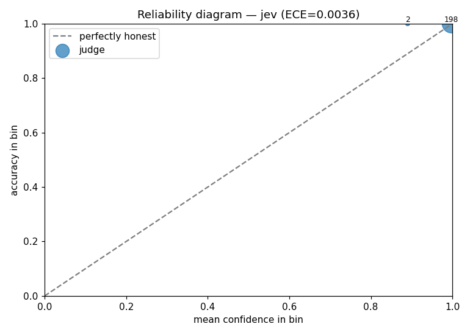
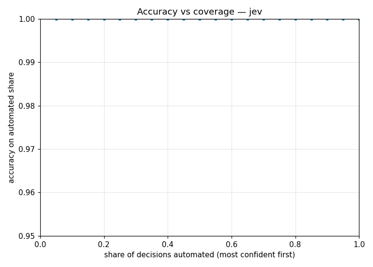

# Audit — Jev on clean business emails

> **REAL VENDOR AUDIT** — TypeSafe Jev (`typesafe-ai/jev`) via the AI Gateway evaluate API, 2026-09-18.
> Raw per-row responses: [`runs/audit-jev-real.ckpt.jsonl`](runs/audit-jev-real.ckpt.jsonl) · metrics: [`audit-jev-real.json`](audit-jev-real.json) · dataset: [`examples/email-routing/labels.jsonl`](../examples/email-routing/labels.jsonl) (seed 42).
> Recompute: `python scripts/verify_published.py`.

**n=200** · accuracy **100.0 %** · ECE **0.0036** · cost **$0.0037** · p50 **0.86 s** · p99 **7.5 s**

## Read this first

- **The dataset is easy by construction.** 24 templates × item/number fills produce 200 rows (161 distinct texts) across 10 categories in English and German. Every template contains the vocabulary of its category ("quote", "invoice … wrong", "return"). A 100 % here is the floor a judge must clear, not evidence of production accuracy.
- **With accuracy at 100 %, ECE degenerates.** When nothing is wrong, ECE equals `1 − mean confidence`. The 0.0036 says the judge reports ~0.996 confidence and is always right — consistent, but it does not test whether confidence *falls* when the judge is wrong. The adversarial audit does.
- Only two reliability bins are populated (198 rows in 0.9–1.0, 2 in 0.8–0.9). Nothing can be said about calibration below 0.8 from this run.
- p99 of 7.5 s is a gateway tail, not a model property: one row waited on a rate-limit window. p50 is 0.86 s.

## What it does show

| Question | Answer on this dataset |
|---|---|
| Does the judge reproduce human labels on templated business email? | Yes, 200/200, both languages. |
| Does it claim high confidence when it is right? | Yes: min 0.89, mean 0.997. |
| Cost per 1,000 decisions | ≈ $0.019 (378–440 input tokens per email at $0.042/MTok; output free). |
| Zero-error coverage | 100 % (threshold 0.89) — retrospective on this dataset. |

## Reliability bins

| confidence bin | avg confidence | accuracy | n |
|---|---|---|---|
| 0.8–0.9 | 0.890 | 100 % | 2 |
| 0.9–1.0 | 0.998 | 100 % | 198 |

## Caveats

- Synthetic, seeded dataset; no real customer email. Regenerate with `python examples/email-routing/generate.py`.
- Not comparable 1:1 with the external 1,565-email community benchmark (96.4 %): different data, different difficulty.
- Retrospective on this dataset — not a production guarantee.
